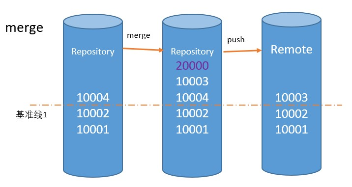
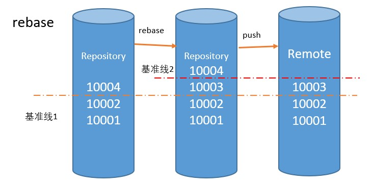

# git-third
merge 和 rebase的对比

## merge
将分叉的分支合并在一起, 并额外产生一个没有意义的提交

## rebase

将分叉的分支合并在一起,不会额外产生提交

并且保证rebase的分支是基准, 比如: remote的提交在最底层, 新的提交会在它的上面

rebase的图可以这样理解, 假如10004是先提交的(不是push), 10003是后提交的, 本来应该是

    10003
    10004
    10002
    10001

但是因为用rebase命令基于 remote, 命令可能是`git rebase origin/main`,所以变成了

    10004
    10003
    10002
    10001

从而保证了, 谁 后push 到服务器上的, 谁的commit就在上面